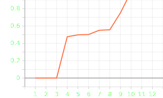
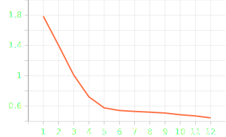
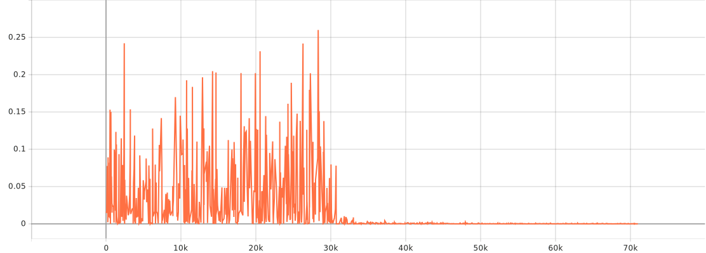
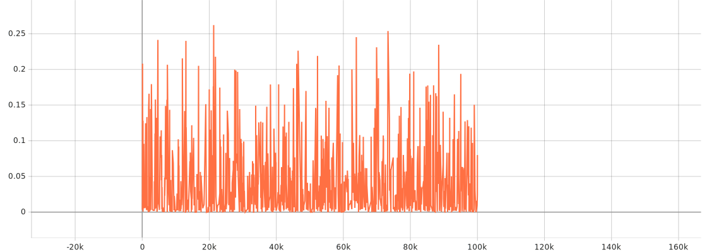

## Final report

### Experiment I - Embedded Reber Grammar (ERG)

Before executing the experiment, 512 paths has been generated with equal probabilities for all the possible moves in each state.
They are saved in a .txt file for future operations and potential tests reproduction.

Implemented experiment class enables training and validation for three different models:
- Long Short Term Memory (LSTM) from [pytorch](https://docs.pytorch.org/docs/stable/generated/torch.nn.LSTM.html);
- Gated Recurrent Unit (GRU) from [pytorch](https://docs.pytorch.org/docs/stable/generated/torch.nn.GRU.html);
- Linear Recurrent Unit (LRU) from [gothos/lru-pytorch](https://github.com/Gothos/LRU-pytorch/tree/main/LRU_pytorch).

Training process is run for randomly chosen 256 strings from generated dataset. Each epoch 
Testing uses all the 512 paths, according to the original experiment description.
Condition score is calculated based on the percentage of sequences where all valid characters are ranked higher than other invalid steps.
Process is stopped when the condition score reaches 1.0 or when the last 10 scores are higher than 0.95.
Mean results of 30 trials executed for each model with described parameters are shown in Table 1.1.

| Model | Learning rate | Hidden size | Success rate | Mean highest achieved condition score | Mean number of epochs |
|-------|---------------|-------------|--------------|---------------------------------------|-----------------------|
| LSTM  | 0.2           | 64          | 100%         | 1.0000                                | 14.70                 |
| GRU   | 0.2           | 64          | 100%         | 1.0000                                | 13.67                 |
| LRU   | 0.2           | 64          | 3.3%         | 0.9833                                | 50.79                 |
*Table 1.1 - Mean effectiveness metrics for each described model with its parameters.*

Graphs 1.1, 1.2, and 1.3 present the condition score and loss over epochs from single example tests for the LSTM, GRU, and LRU models, respectively.

---------

    

        
        
(a)

    

    

        
        
(b)

    

    <em>Graph 1.1. (a) Condition score and (b) training loss over epochs of LSTM experiment</em>

----------

    

        
        
(a)

    

    

        
        
(b)

    

<em>Graph 1.2. (a) Condition score and (b) training loss over epochs of GRU experiment</em>

---------

    

        
        
(a)

    

    

        
        
(b)

    

<em>Graph 1.3. (a) Condition score and (b) training loss over epochs of LRU experiment</em>

------------------

The results demonstrate the clear superiority of gated architectures (LSTM and GRU), which achieved a 100% success rate with rapid convergence (averaging under 15 epochs). 
In contrast, the LRU model struggled to meet the strict success criterion, attaining only a 3.3% success rate and requiring significantly longer training (over 50 epochs). 
However, the LRU's high mean condition score (0.9833) suggests that while it captures the general grammatical structure effectively, it lacks the precision to consistently separate all valid transitions from invalid ones.

The main reason for the LRU's underperformance might be its linear nature. 
The Reber Grammar is based on discrete states, requiring the model to make sharp, sudden changes in its predictions.
LSTM and GRU models handle this easily thanks to their non-linear gates. 
LRU is able to learn the general rules, but because of its linear recurrence it can not achieve the absolute precision.

### Experiment IV - Adding problem

Experiment explores the long-time lag problem, model has to remember values for long periods
of time.

Generated sequences consist of 100 elements. Each element is a pair of components. First component is a value chosen randomly from [-1, 1].
Second component is a marker. One of the first 10 values is marked 1 and this value we call x1. Another value is chosen
from first half of the sequence (it can't be the same as x1) - it also gets marked 1 and we call it x2.
In the rare case when first element is marked 1 we change x1 or x2 (depending on whether it was chosen the first or second time) to 0.
First and last value are marked -1. The rest is marked 0. Target value is 
$0.5 + \Large\frac{x1 + x2}{4.0}$ - sum of the values marked by 1 scaled to [0, 1] interval.

Because the second half of the sequence must be "ignored" model must learn to keep only marked values and
not lose them through the time. This is a problem for many recurrent models.

In the experiment we tested 3 models: LSTM from [pytorch](https://docs.pytorch.org/docs/stable/generated/torch.nn.LSTM.html), GRU from [pytorch](https://docs.pytorch.org/docs/stable/generated/torch.nn.GRU.html) and LRU from [gothos/lru-pytorch](https://github.com/Gothos/LRU-pytorch/tree/main/LRU_pytorch).
Hidden size was set to 64. Optimizer RMSprop with 10-3 learning rate was used, as in Arjovsky & Shah, 2016 article it demonstrated
faster convergence in long-time lag problems than typically used SGD. 
Models were trained using on-line learning (no batches), in each iteration
new sequence was generated and used to train. Gradient clipping was applied to avoid
gradient explosion. LSTM's forget gate was initialized to ensure long-term memory. Conditions to end training were: average training error
below 0.01 and 2000 most recent sequences processed correctly. Sequence
processed correctly means absolute error < 0.04. Results were visualised
in Tensorboard. Evaluation on 2560 new sequences was run after learning.

For LSTM and GRU models we observed learning and both were able
to achieve conditions necessary to finish training. Graphs 2.1 and 2.2 present MSE loss during
example trials for each model.

*Graph 2.1. MSE error while training LSTM model (example trial).*

*Graph 2.2. MSE error while training GRU model (example trial).*

Below are presented average results from 10 trials.

*Table 2 Adding experiment results for GRU and LSTM.*

| Model | # wrong predictions | Success after |
|:------|:-------------------:|--------------:|
| GRU   |   6.8 out of 2560   |      69 922.7 |
| LSTM  |   2.4 out of 2560   |      66 169.9 |

For LRU model we didn't observe learning in presented conditions. Accuracy in evaluation (after 100 000 training iterations)
was around 0.14-0.16. This matches the scheme of most models in long-time lag problems.
They naively predict mean value - in this case 0.5. Probability of
target satisfying inequality: |target - 0.5| < 0.04 is ~15.4%. Graph 2.3 presents 
MSE loss during LRU training.

*Graph 2.3. MSE error while training LRU model (example trial).*

### Experiment V - Multiplication Problem

#### Introduction

This experiment faces similar problem as the previous experiment, 
but with a non-integrative solution.

Sequences were generated in the same way as in Adding problem,
but values are from the interval [0, 1].
Markers were randomly chosen in the same way as in Adding problem,
but in the rare cases, when first element is marked 1 we change 
$x1$ or $x2$ to 1, depending on if it was chosen the first or second time.
The target value is $x1 * x2$ - product of marked values.

Prediction was accepted when absolute error was lower than 0.04.
In order to end training model had to make less than
13 wrong predictions in last 2000 steps, which is enough 
for fine-tuning the output.

#### Experiment

Tested models were:
LSTM and GRU from PyTorch, and LRU from Gothos-pytorch.

For GRU and LSTM hidden size was set to 64. 
Training used the same optimizer as in the previous problem,
with learning rate 0.001.
Models faced problems with gradient explosion.
To solve it we used gradient clipping.

Models were trained using on-line learning.
During each step a new data sequence was generated.
Evaluation was made on 2560 new sequences.

#### Results

LSTM and GRU models achieved necessary conditions
to finish training.
Table 1 presents average results of 10 trainings.

| Model | # wrong predictions | Success after |
|:------|:-------------------:|--------------:|
| LSTM  |                     |               |  
| GRU   |                     |               |  

*Table 3. Results of training LSTM and GRU models.*

LRU model did not meet the necessary conditions to finish training.
After 150 000 training iterations prediction accuracy was ~15% - 
similar results as in Adding problem. 

During each training MSE error was saved in a Tensorboard. 
Graphs 3.1-3 shows examples of training, one for each model.

*Graph 3.1. Example of MSE error while training LSTM model.*

*Graph 3.2. Example of MSE error while training LRU model.*

*Graph 3.3. Example of MSE error while training GRU model.*

